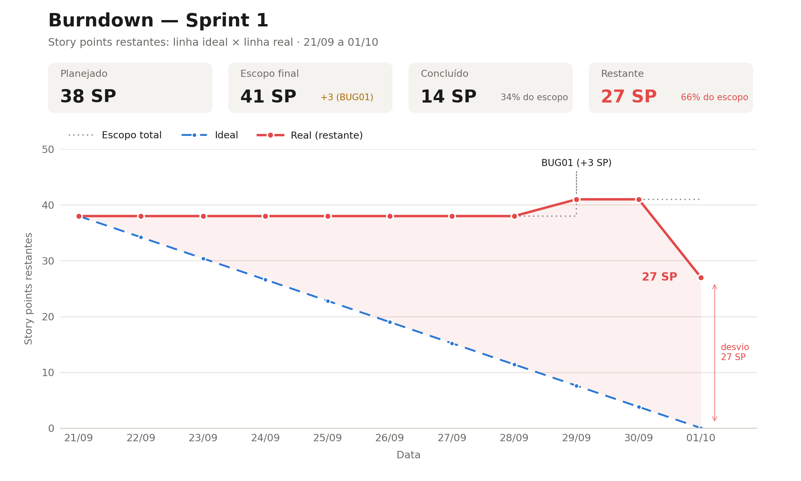

# Métricas — Sprint 1

## Story Points planejados

No início da Sprint foram planejados **38 Story Points**, distribuídos entre as histórias selecionadas dos épicos E01, E02, E03 e E04.

| Item | Story Points planejados |
|---|---:|
| E01 — Autenticação e Usuários | 14 |
| E02 — Cadastro de Idosos e Responsáveis | 8 |
| E03 — Gestão de Medicamentos | 8 |
| E04 — Registro de Rotina | 8 |
| **Total planejado inicialmente** | **38** |

Durante a Sprint foi identificado o BUG01 — Registro de idosos duplicado, estimado em **3 Story Points**.

Com sua inclusão, o Sprint Backlog passou a possuir um escopo total de **41 Story Points**.

---

## Story Points concluídos

Ao final da Sprint, foram concluídos os seguintes itens de acordo com a Definition of Done:

| História | Story Points |
|---|---:|
| E01-US01 — Cadastro de Administrador | 3 |
| E01-US02 — Login de Administrador | 3 |
| E01-US03 — Login de Cuidador | 3 |
| E01-US04 — Criação de contas para Cuidadores e Familiares | 5 |
| **Total concluído** | **14** |

As histórias parcialmente executadas ou pendentes não foram contabilizadas como concluídas.

O BUG01 também não foi contabilizado, pois sua correção permaneceu pendente.

---

## Velocity

A velocity da Sprint é calculada pela soma dos Story Points dos itens que atenderam integralmente à Definition of Done:

Velocity = soma dos Story Points concluídos

Aplicando os valores da Sprint 1:

Velocity = 3 + 3 + 3 + 5  
Velocity = 14 Story Points

**Velocity da Sprint 1: 14 Story Points**

A velocity obtida nesta Sprint poderá ser utilizada como referência inicial para estimar a capacidade da equipe nas próximas Sprints.

---

## Taxa de conclusão

A taxa de conclusão foi calculada considerando os Story Points planejados inicialmente:

Taxa de conclusão = Story Points concluídos / Story Points planejados × 100

Aplicando os valores:

Taxa de conclusão = 14 / 38 × 100

**Taxa de conclusão: 36,84%**

Considerando o escopo final após a inclusão do BUG01:

14 / 41 × 100 = 34,15%

Resumo:

- **Planejamento inicial:** 38 SP;
- **Escopo adicional:** 3 SP;
- **Escopo final:** 41 SP;
- **Story Points concluídos:** 14 SP;
- **Velocity:** 14 SP;
- **Taxa de conclusão sobre o planejamento inicial:** 36,84%;
- **Taxa de conclusão sobre o escopo final:** 34,15%.

---

## Burndown

O burndown representa a quantidade de Story Points restantes ao longo da Sprint.

Como os Story Points somente são considerados concluídos quando a história atende integralmente à Definition of Done, histórias em andamento não tiveram seus pontos parcialmente descontados.

O BUG01 foi identificado em 29/09 e acrescentou 3 Story Points ao trabalho restante.

### Gráfico de Burndown

### Trabalho restante

| Dia | Data | Story Points restantes | Evento |
|---|---|---:|---|
| Início | 21/09 | 38 | Início da Sprint |
| Dia 1 | 22/09 | 38 | E01 em desenvolvimento |
| Dia 2 | 23/09 | 38 | Desenvolvimento das funcionalidades de autenticação |
| Dia 3 | 24/09 | 38 | Continuidade do E01 |
| Dia 4 | 25/09 | 38 | Funcionalidades do E01 validadas; documentação ainda pendente |
| Dia 5 | 26/09 | 38 | E02-US01 em andamento |
| Dia 6 | 27/09 | 38 | E04-US01 em andamento |
| Dia 7 | 28/09 | 38 | E04-US02 em andamento |
| Dia 8 | 29/09 | 41 | BUG01 identificado e adicionado ao Sprint Backlog |
| Dia 9 | 30/09 | 41 | Revisão dos itens em andamento |
| Final | 01/10 | 27 | E01 atende integralmente à DoD; 14 SP concluídos |

---

## Linha ideal de referência

Considerando os **38 Story Points inicialmente planejados** e uma redução uniforme do trabalho ao longo dos 10 dias da Sprint, a linha ideal seria aproximadamente:

| Dia | Story Points restantes — ideal |
|---|---:|
| Início | 38,0 |
| Dia 1 | 34,2 |
| Dia 2 | 30,4 |
| Dia 3 | 26,6 |
| Dia 4 | 22,8 |
| Dia 5 | 19,0 |
| Dia 6 | 15,2 |
| Dia 7 | 11,4 |
| Dia 8 | 7,6 |
| Dia 9 | 3,8 |
| Final | 0 |

---

## Interpretação

O burndown real permaneceu acima da linha ideal durante toda a Sprint.

Embora diferentes histórias tenham sido trabalhadas ao longo do período, os Story Points não foram reduzidos enquanto os itens não atendiam integralmente à Definition of Done.

Por esse motivo, o trabalho restante permaneceu em **38 Story Points** durante a maior parte da Sprint.

Em 29/09, a identificação do BUG01 acrescentou **3 Story Points** ao Sprint Backlog, elevando temporariamente o trabalho restante para **41 Story Points**.

No encerramento da Sprint, as quatro histórias do E01 — Autenticação e Usuários atenderam integralmente à Definition of Done, totalizando **14 Story Points concluídos**.

A Sprint terminou com **27 Story Points não concluídos** no escopo final.

O resultado indica que o volume de trabalho inicialmente planejado foi superior à capacidade observada da equipe durante a Sprint.

A velocity de **14 Story Points** fornece uma primeira referência para o planejamento das próximas Sprints, permitindo ajustar a quantidade de trabalho selecionada de acordo com a capacidade demonstrada pela equipe.

---

## Observação

O burndown foi reconstruído a partir dos registros disponíveis da Sprint, incluindo:

- movimentações dos itens no GitHub Project;
- estado das histórias no Sprint Backlog;
- registro de execução;
- conclusão das histórias do E01;
- identificação e inclusão do BUG01.

A reconstrução considera a Definition of Done como critério para redução efetiva dos Story Points restantes.